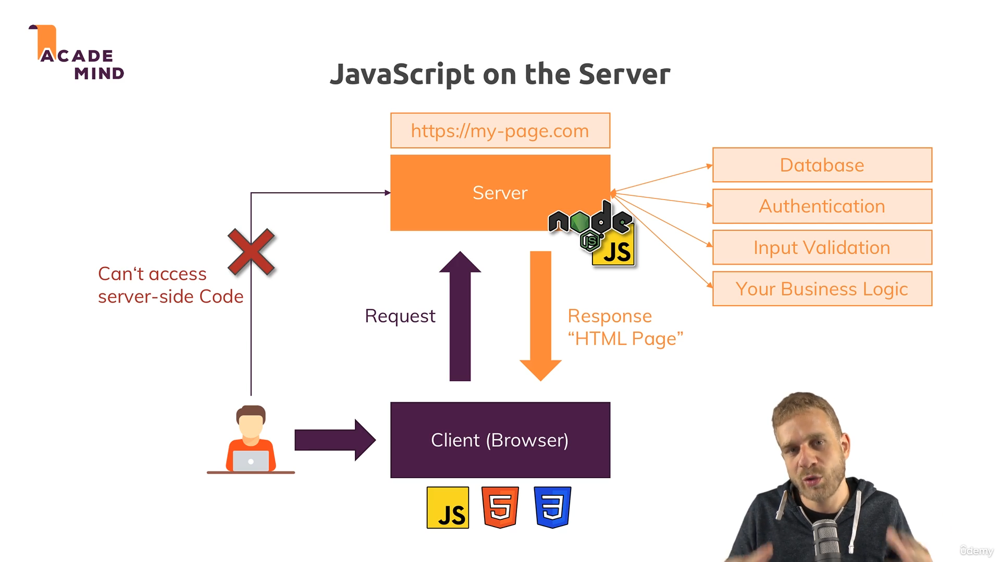
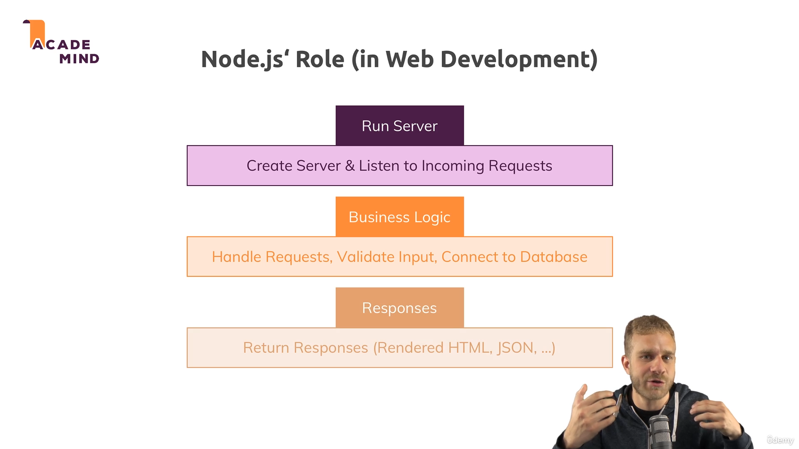
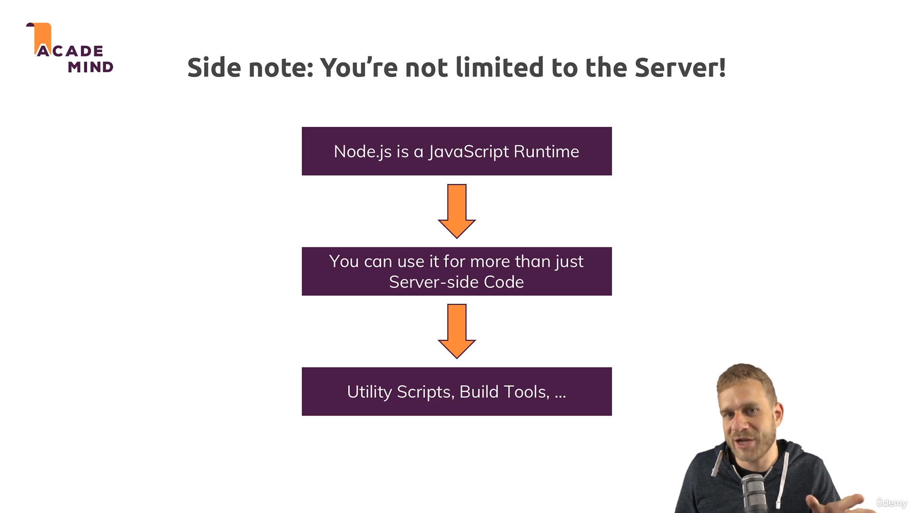
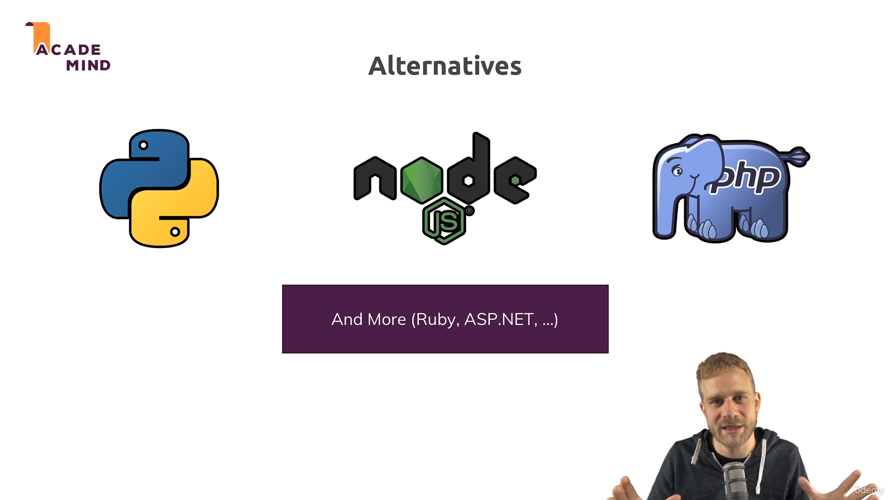

# 📘 Node.js Overview – Easy Hinglish Guide

## 🔰 Node.js kya hai?

Node.js ek **JavaScript runtime** hai jo server-side code chalane ke liye use hota hai. Normally JavaScript sirf browser me chalta hai, lekin Node.js se hum **server pe JavaScript** code run kar sakte hain.

---

## 💻 Browser vs Server Code

Browser me hum **HTML, CSS aur JavaScript** use karke webpages banate hain. Jab user `mypage.com` pe jata hai, ek **request** server ko bheji jaati hai.

Waha server user ki request handle karta hai aur **response** me HTML, CSS, JS files ya data bhejta hai.

📸 **Refer image:**  

---

## ⚙️ Server side pe kya hota hai?

Server pe aise kaam hote hain jo browser me nahi karne chahiye:

- 🔐 **User Authentication** (e.g. login)
- 📊 **Database connection**
- ✅ **Input validation** (browser ka code edit ho sakta hai)
- ⚙️ **Business logic** (jo user ko dikhani nahi hoti)

Ye sab Node.js se server pe handle kiya jaata hai.

📸 **Refer image:**  

---

## 🖥️ Node.js use kaise hota hai?

Node.js me hum sirf logic nahi likhte, **server code bhi khud likhte hain**.

- PHP jaise languages me Apache ya Nginx server kaam karta hai
- Lekin Node.js me hum **server bhi banaate hain aur logic bhi likhte hain**

---

## 🛠️ Node.js aur bhi kaha use hota hai?

Node.js sirf web server ke liye nahi hai. Ye use hota hai:

- 🔧 Local utility scripts
- 📦 Build tools (React, Angular, Vue ke project me jo build hota hai wo Node.js se hota hai)
- 📁 File read/write operations

📸 **Refer image:**  

---

## 💡 Node.js ka fayda kya hai?

- JavaScript pe already frontend banta hai
- Node.js se backend bhi same language me likh sakte ho
- Ek language se **poori web app** bana sakte ho
- Fast, trending aur industry demand high hai

---

## 🔁 Alternatives of Node.js

Agar Node.js nahi use karte to aur options hain:

- **Python (Flask, Django)**
- **PHP (Laravel)**
- **ASP.NET**
- **Ruby on Rails**

Lekin Node.js ka major benefit hai: **Single Language for frontend + backend = JavaScript**

📸 **Refer image:**  

---

## 📌 Summary

| 🔸 Feature | 🔹 Node.js Benefit |
|-----------|---------------------|
| Language | JavaScript |
| Usage | Server-side + Utility tools |
| Advantage | Fast, Single Language, Real-time |
| Used In | APIs, Web Apps, Tools |

---

📝 **Conclusion**: Node.js seekhna aaj ke time me **smart choice** hai. Isme performance bhi achha hai, aur aapko alag backend language nahi seekhni padti. Bas JavaScript se poora kaam ho jaata hai!
