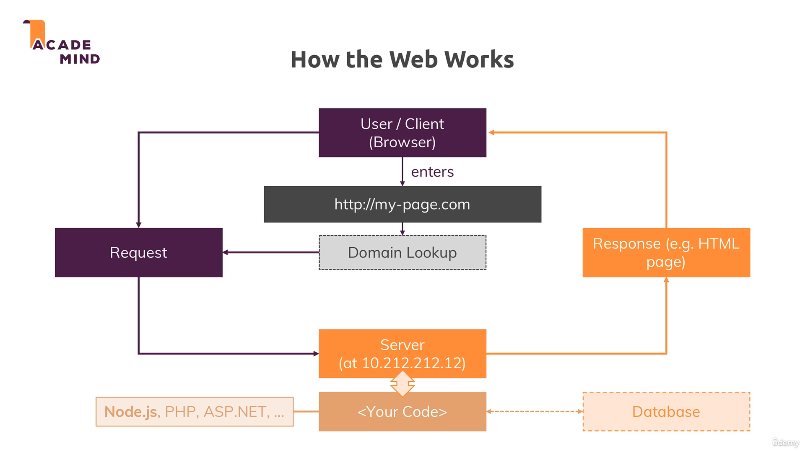

# 🌐 Web Kaise Kaam Karta Hai? (Quick Recap)

Agar aap already sab jaante ho, toh is lecture ko skip kar sakte ho. Warna, chalo ek baar phir se samajh lete hain.

---

## 👨‍💻 User (Client) Side

Soch lo ki aap ek user ho jo browser pe koi website visit kar raha hai. Jab aap browser mein **URL** type karte ho (jaise `www.google.com`), toh aapka browser **Domain Name Server (DNS)** se poochta hai ki yeh domain ka actual address kya hai.

- Domain naam (jaise google.com) ek **human-friendly name** hota hai.
- Uske peeche ek **IP Address** hota hai (machine-friendly).
- Browser is IP address ko use karke **server tak request bhejta hai**.

---

## 💡 Node.js Yahan Aata Hai Kaam Mein

Ab yeh IP address jis computer ka hai, woh internet pe kahin exist karta hai — aur aapka **Node.js code** us computer pe run ho raha hota hai.

📦 Node.js ka kaam hota hai:
- Server banana
- Aayi hui **request ko handle** karna
- Database se connect karna (agar zarurat ho)
- Input validate karna
- Aur finally, **response bhejna**

📸 **Refer image:**  

---

## 📤 Response Kya Hota Hai?

Jab server ka kaam ho jaata hai (jaise user ka data validate kar liya, DB se data nikaal liya), tab server user ko ek **response** bhejta hai.

Response ho sakta hai:
- HTML code
- JSON data
- File (jaise PDF, image)
- Ya kuch aur

**Request aur Response dono ke saath "headers" bhi hote hain**, jo meta-information le jaate hain. Jaise: data ka type, length, etc.

---

## 📡 HTTP / HTTPS Protocol

Browser aur Server ke beech data kaise jaata hai? Iske liye ek **protocol** follow hota hai — jise hum kehte hain:

- **HTTP**: HyperText Transfer Protocol — basic communication rules
- **HTTPS**: HTTP + SSL encryption (data secure ho jaata hai)

👉 HTTPS ka use tab karte hain jab hume **secure connection** chahiye (jaise banking websites).

Course ke end mein hum dekhenge kaise HTTPS enable karna hai. Filhaal development ke liye **HTTP** hi kaafi hai.

---

## 🧑‍💻 Summary

- Aap browser mein URL type karte ho
- Browser DNS se IP address leta hai
- Browser request bhejta hai server ko
- Aapka Node.js code server pe chalu hota hai
- Node.js request handle karta hai, response prepare karta hai
- Response client ko bhej diya jaata hai

Yahi hai web ka **basic working** — aur **Node.js ka role** usme.

Ab hum Node.js se server banana shuru karte hain! 🚀
