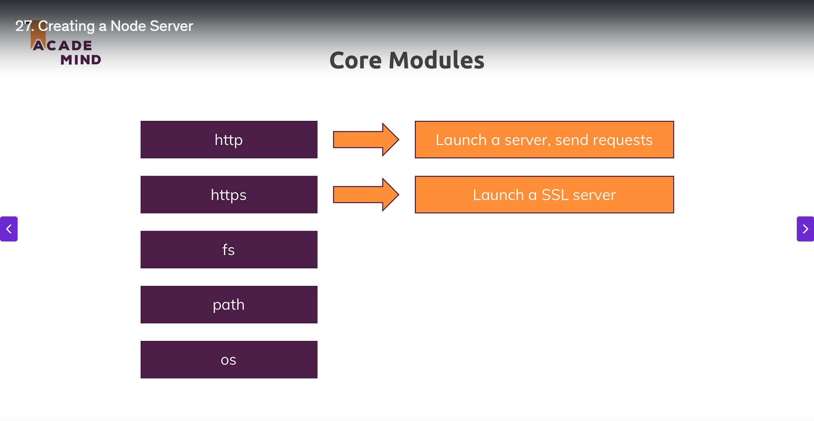

# 📦 Node.js Server Setup – Hinglish Guide

## 📁 Folder Setup
Maan lo aapke paas ek khaali folder hai. Ab aap us folder ke andar ek naya file banaoge. File ka naam kuch bhi rakh sakte ho, lekin aksar isse server.js ya app.js rakhte hain kyunki yahi root file hoti hai jo aapka Node.js application start karti hai.

## 🧠 Node.js Code – Server Banana
Node.js code usually server pe run hota hai (jaise kisi cloud machine pe). Toh hum is file ka naam app.js rakh rahe hain.

Ab hum is file ke andar ek server banana chahte hain. Pehle ke module mein humne fs (file system) module ka use kiya tha files ke saath kaam karne ke liye.

## 🤔 Functionality Import Karna Kyon Zaroori Hai?
JavaScript mein kuch basic functions toh by default milte hain, lekin zyada tar powerful features use karne ke liye hume modules ko import karna padta hai. Ye isliye hota hai taaki global namespace zyada polluted na ho jaye aur har file mein clearly pata chale ki woh file kin features pe depend karti hai.

## 🧰 Core Modules – Built-in Tools
Node.js kuch core modules ke sath aata hai, jaise:

- **fs**: file system se kaam
- **path**: path banane ke liye
- **os**: operating system ke info ke liye
- **http / https**: server create karne ke liye

📸 **Refer image:**  


Ab hum `http` module ka use karenge, jo HTTP request/response handle karta hai. `https` encrypted (secure) servers ke liye hota hai, jise hum course ke end mein dekhenge.

## 📥 Module Import Karna

```js
const http = require('http');
```

`require()` ek special Node.js function hai jo kisi module ko import karta hai.

`http` ek core module hai, toh path nahi likhna hota (jaise `./http`), warna woh local file samjhega.

## 🖥️ Server Create Karna

```js
const server = http.createServer(requestListener);
```

Yaha `createServer()` ek function leta hai – request listener function, jo har incoming request pe call hota hai.

**Example:**

```js
function requestListener(req, res) {
  console.log(req);
}
```

**Ya anonymous function:**

```js
const server = http.createServer(function(req, res) {
  console.log(req);
});
```

**Ya arrow function:**

```js
const server = http.createServer((req, res) => {
  console.log(req);
});
```

- `req` (request): Jo bhi request aaye uski info deta hai
- `res` (response): Jiska use hum reply bhejne ke liye karte hain

Node.js event-driven architecture follow karta hai – "jab request aaye, tab function chalao".

## 🟢 Server Ko Start Karna (Listen Karna)

```js
server.listen(3000);
```

`listen()` ka use server ko ek port pe start karne ke liye hota hai.

- Port 3000 ek common development port hai.
- `localhost:3000` pe server chalu ho jayega.

## ✅ Server Test Karna

Terminal open karo aur run karo:

```bash
node app.js
```

Browser mein jao:

```bash
http://localhost:3000
```

Browser mein kuch visible nahi hoga (kyunki response send nahi kiya), lekin terminal mein request object log ho jayega.

---

## 🔁 Summary:

- File banao: `app.js`
- Import karo: `const http = require('http')`
- Create server: `http.createServer((req, res) => {...})`
- Start karo server: `server.listen(3000)`
- Visit karo: `localhost:3000`
