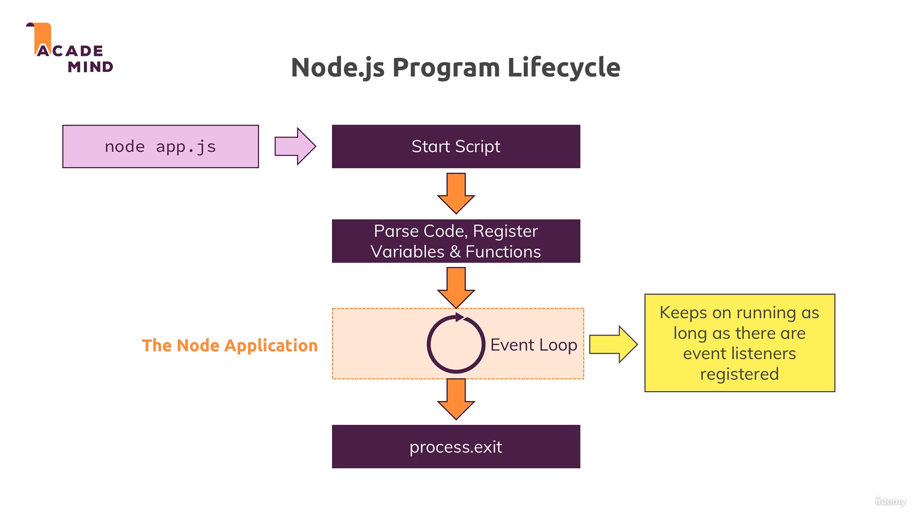
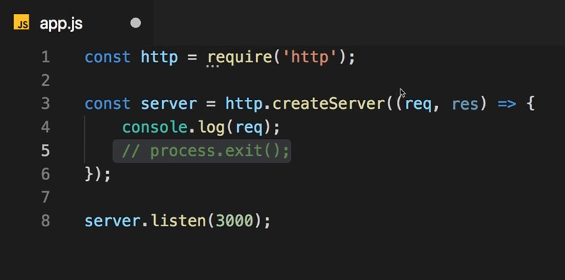

# 🚀 Pehla Node.js Server Banaya!  
Last lecture mein humne apna pehla chhota Node.js server banaya tha.  
Lekin abhi wo poori tarah se ready nahi tha — jaise response dena baaki tha.  
Phir bhi, ye hume dikhaata hai ki hum server side code Node.js mein kaise likhte hain, aur apna khud ka server kaise banate hain.  

---

# 🔄 Node.js Mein Event Loop Kya Hai?  
Jab humne `node app.js` chalaya, toh Node.js ne apni magic shuru ki: poora code padh liya, variables aur functions register kiye, aur phir execution start kar diya.  
Lekin, ek important baat ye thi ki ye program kabhi band nahi hua!  

**Ye kyun hua?**  
Kyuki Node.js ke paas ek **Event Loop** hota hai — ek continuous loop jo tab tak chalta rahta hai jab tak we have some event listener registered.

📸 **Refer image:**  

---

# 🎧 Event Listener Jo Kabhi Band Nahi Hota  
Humne `createServer` ke andar ek event listener banaya tha jo hamesha incoming requests sunta rehta hai. ( with the help of event loop).
Is listener ko kabhi unregister nahi karte, kyunki server toh chalu rehna chahiye!  
Isliye, Node.js ka event loop hamesha chal raha hota hai — server active rehta hai.  

---

# 🧵 Single Thread + Multi-Tasking Ka Jadoo  
Node.js single-threaded JavaScript chalata hai — matlab ek hi thread use karta hai.  
Phir bhi wo hazaaro requests ko ekdum efficiently handle karta hai, kyunki:  
- Event loop constantly ready rehta hai  
- Jab bhi koi event (request) aati hai, wo usko turant handle karta hai  
- Operating System ke multi-threading features bhi backend mein madad karte hain  

---

# ⚠️ Process Exit Se Server Kaise Band Hota Hai?  
Agar hum code mein `process.exit()` likh dein, toh ye event loop ko forcibly bandh kar deta hai, aur server close ho jata hai.  
Normal server mein aapko ye nahi karna chahiye, warna users aapki website access nahi kar paayenge.  

📸 **Refer image:**  

---

# 🔑 Summary — Node.js Server Kaise Chalata Hai?  
- `node app.js` se Node.js apna event loop start karta hai  
- Event loop tab tak chalta hai jab tak event listener active hai  
- Server asynchronous requests ko ek hi thread mein efficiently handle karta hai  
- `process.exit()` se hum event loop ko band kar sakte hain, par ye sirf samajhne ke liye use hota hai  

---

# 🎯 Next Step: Request & Response Ke Saath Kaam Karna  
Ab hum seekhenge ki `createServer` ke function mein jo **request** aur **response** objects milte hain, unke saath kaise kaam karte hain, taaki server se meaningful response bhej sakein!  
