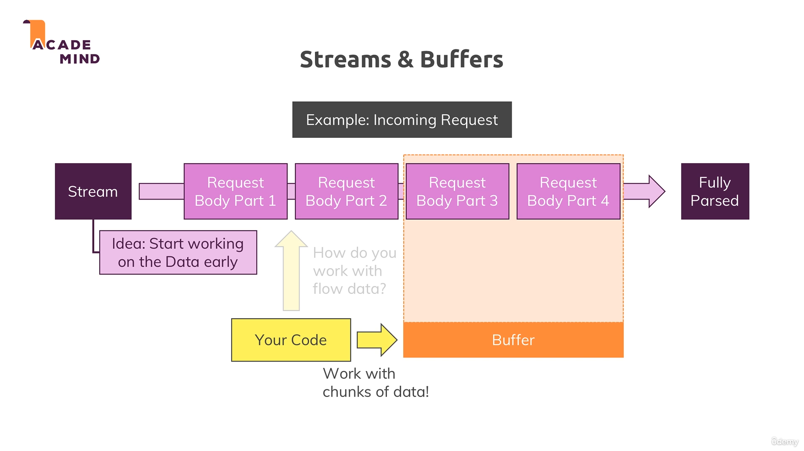

# 📥 Request Data Kaise Parse Karein?

Ab hum seekhenge ki incoming requests se data kaise nikaalte hain. Jab user form submit karta hai, toh wo data request ke saath aata hai aur humein usse parse karna hota hai.

## 🤔 Request Data Kahan Milta Hai?

Request object mein `url` aur `method` toh mil jaate hain, lekin **data directly nahi milta**. 

Incoming data **stream** ke form mein aata hai - yani chhote-chhote chunks mein. Yeh isliye kyunki Node.js nahi jaanta ki request kitni badi hogi.

📸 **Refer image:**  


## 🌊 Stream Aur Buffer Kya Hai?

### Stream
- Data continuous flow mein aata hai
- Chunks mein data receive hota hai  
- File upload jaise bade data ke liye useful hai
- Saara data wait nahi karna padta

### Buffer
- Bus stop ki tarah concept hai
- Multiple chunks ko organize karta hai
- Saare chunks ko ek jagah collect karke readable banata hai

## 📝 Request Data Parse Karne Ka Process

### Step 1: Event Listeners Setup Karna

```javascript
const body = [];

// Data chunks collect karne ke liye
req.on('data', (chunk) => {
    body.push(chunk);
});

// Saara data receive hone ke baad
req.on('end', () => {
    // Yahan data parse karenge
});
```

### Step 2: Buffer Concat Karna

```javascript
req.on('end', () => {
    const parsedBody = Buffer.concat(body).toString();
    console.log(parsedBody); // message=hello
});
```

### Step 3: Message Extract Karna

```javascript
const message = parsedBody.split('=')[1];
console.log(message); // hello
```

## 🔧 Complete Working Code

```javascript
const http = require("http");
const fs = require("fs");

const server = http.createServer((req, res) => {
  const url = req.url;
  const method = req.method;
  
  // Home page with form
  if (url === "/") {
    res.writeHead(200, { "Content-Type": "text/html" });
    res.write(`
      <html>
        <head></head>
        <body>
          <form action="/message" method="post">
            <input type="text" name="message" />
            <button type="submit">Submit</button>
          </form>
        </body>
      </html>
    `);
    return res.end();
  }
  
  // Form submission handle karna
  if (url === "/message" && method === "POST") {
    const body = [];
    
    // Data chunks collect karna
    req.on("data", (chunk) => {
      body.push(chunk);
    });
    
    // Saara data receive hone ke baad
    req.on("end", () => {
      const parsedBody = Buffer.concat(body).toString();
      const message = parsedBody.split("=")[1];
      
      // File mein save karna
      fs.writeFileSync("message.txt", message);
      
      // Redirect back to home
      res.statusCode = 302;
      res.setHeader("Location", "/");
      return res.end();
    });
    
    return; // Important: yahan return karna zaroori hai
  }
  
  // 404 page
  res.writeHead(404, { "Content-Type": "text/html" });
  res.write(`
    <html>
      <head></head>
      <body>
        <h1>Page not found</h1>
      </body>
    </html>
  `);
  res.end();
});

server.listen(3000, () => {
  console.log("Server is running at http://localhost:3000/");
});
```

## ⚠️ Important Points

### 🚫 Blocking Code Problem
```javascript
// ❌ Yeh galat hai - writeFileSync yahan nahi chalega
if (url === "/message" && method === "POST") {
    fs.writeFileSync("message.txt", "data"); // Too early!
    req.on("data", (chunk) => {
        // Data abhi aaya nahi hai
    });
}
```

### ✅ Correct Way
```javascript
// ✅ Yeh sahi hai - writeFileSync end event mein
req.on("end", () => {
    const message = parsedBody.split("=")[1];
    fs.writeFileSync("message.txt", message); // Perfect timing!
});
```

## 🔍 Data Format Samajhna

Form submit karne par data yeh format mein aata hai:
```
message=hello+world
```

- `message` = input field ka name
- `hello+world` = user ka input (spaces + mein convert ho jaate hain)

## 🚀 Server Chalane Ka Tarika

```bash
# Server start karo
node app.js

# Browser mein open karo
# http://localhost:3000

# Form fill karke submit karo
# message.txt file check karo
```

## 🎯 Key Concepts Summary

1. **Stream**: Data chunks mein aata hai
2. **Buffer**: Chunks ko organize karta hai  
3. **Event Listeners**: `data` aur `end` events handle karte hain
4. **Asynchronous**: Code immediately execute nahi hota, event-driven hai
5. **Form Data**: `key=value` format mein aata hai

## 🔜 Next Steps

Yeh raw Node.js ka tareeka hai. Aage hum **Express.js** seekhenge jo yeh sab kaam bahut asaan bana deta hai. Lekin pehle yeh samajhna zaroori tha ki peeche kya ho raha hai!

---

**Pro Tip**: Yeh complex lag sakta hai, lekin Express.js mein yeh sab ek line mein ho jaata hai! 😊