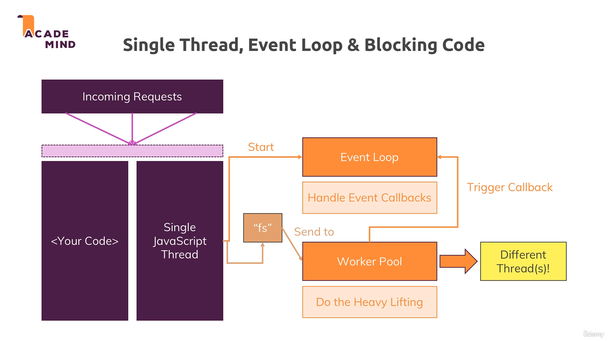
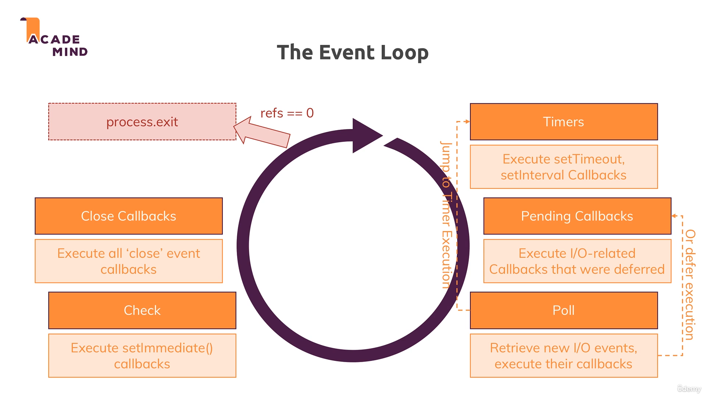

# 🔄 Node.js Event Loop Aur Asynchronous Programming

Node.js ki sabse important concept hai **Event Loop** aur **Single Thread Architecture**. Aaiye samajhte hain ki yeh kaise kaam karta hai aur kyun itna powerful hai!

## 🧵 Single Thread - Ek Hi Thread Mein Sab Kuch!

### 🤔 Basic Question: Ek Thread Mein Multiple Requests Kaise Handle Karein?

Node.js sirf **ek single JavaScript thread** use karta hai. Ab sawaal yeh hai:

- Multiple requests kaise handle kare?
- Security issues nahi aate?
- Performance problems nahi hoti?

**Answer**: Node.js ka Event Loop aur Worker Pool system! 🎯



## 🏗️ Node.js Architecture Breakdown

### 1. 📥 Incoming Requests

Jab bhi koi request aati hai, wo Single JavaScript Thread mein handle hoti hai.

### 2. 🔄 Event Loop

- Automatically start hota hai jab Node.js program chalti hai
- Event callbacks ko handle karta hai
- **Fast finishing code** ko execute karta hai
- Continuously loop chalata rehta hai

### 3. 👷 Worker Pool

- **Heavy lifting** ka kaam karta hai
- File operations, Database queries handle karta hai
- Multiple threads use kar sakta hai
- Operating system ke saath directly connect hota hai

## 📊 Event Loop Phases



### 🔄 Event Loop Ke 6 Main Phases:

#### 1. ⏰ **Timers Phase**

```javascript
// setTimeout aur setInterval callbacks execute hote hain
setTimeout(() => {
  console.log("Timer callback executed!");
}, 1000);
```

#### 2. 📋 **Pending Callbacks Phase**

```javascript
// Previous iteration ke deferred I/O callbacks
// File operations ke callbacks yahan execute hote hain
fs.readFile("data.txt", (err, data) => {
  console.log("File read complete!");
});
```

#### 3. 🎣 **Poll Phase**

- New I/O events ke liye check karta hai
- Callbacks ko immediately execute karne ki koshish karta hai
- Agar possible nahi hai toh pending callbacks mein register kar deta hai

#### 4. ✅ **Check Phase**

```javascript
// setImmediate callbacks execute hote hain
setImmediate(() => {
  console.log("setImmediate executed!");
});
```

#### 5. 🔒 **Close Callbacks Phase**

```javascript
// Close events ke callbacks
server.on("close", () => {
  console.log("Server closed!");
});
```

#### 6. 🔄 **Loop Continue or Exit**

- Agar koi pending work hai toh loop continue
- Warna program exit ho jata hai

## 💡 Practical Example

```javascript
const fs = require("fs");

console.log("🚀 Start");

// Timer callback - Phase 1
setTimeout(() => {
  console.log("⏰ setTimeout executed");
}, 0);

// setImmediate callback - Phase 4
setImmediate(() => {
  console.log("✅ setImmediate executed");
});

// File operation - Worker Pool + Phase 2
fs.readFile("package.json", () => {
  console.log("📁 File read completed");
});

console.log("🏁 End");

// Output order:
// 🚀 Start
// 🏁 End
// ✅ setImmediate executed
// ⏰ setTimeout executed
// 📁 File read completed
```

## 🔒 Security Aur Data Separation

### ✅ **By Default Safe Hai**

```javascript
const server = http.createServer((req, res) => {
  // Har request ke liye naya function scope
  const userSpecificData = req.url;

  // Yeh data sirf is request ke liye accessible hai
  // Dusre requests access nahi kar sakte
});
```

### ⚠️ **Global Variables Se Bachein**

```javascript
// ❌ Galat - Global variable
let globalCounter = 0;

const server = http.createServer((req, res) => {
  globalCounter++; // Dangerous! Shared across requests
  res.end(`Request number: ${globalCounter}`);
});

// ✅ Sahi - Request-specific data
const server = http.createServer((req, res) => {
  const requestTime = new Date();
  res.end(`Request time: ${requestTime}`);
});
```

## 🚀 Performance Benefits

### 🔄 **Non-Blocking I/O**

```javascript
// File operation Worker Pool mein chala jata hai
fs.readFile("large-file.txt", (err, data) => {
  console.log("File loaded!");
});

// Yeh immediately execute hoga
console.log("This runs immediately!");

// New requests handle kar sakte hain
// while file is being read
```

### ⚡ **Memory Efficient**

- Ek thread = Less memory usage
- No thread creation overhead
- Faster context switching

## 🔍 References Counter System

```javascript
// Node.js internally track karta hai
let refs = 0;

// Jab event listener add karte hain
server.listen(3000); // refs++

// Jab callback complete hoti hai
fs.readFile("file.txt", callback); // refs++ then refs--

// Jab refs === 0 ho jaaye, program exit
// Server mein usually refs > 0 because listening never ends
```

## 🎯 Key Takeaways

### ✅ **Advantages**

1. **Single Thread** = Less complexity
2. **Event Loop** = Non-blocking operations
3. **Worker Pool** = Heavy operations handled efficiently
4. **Memory Efficient** = Less overhead
5. **High Concurrency** = Multiple requests simultaneously

### ⚠️ **Things to Remember**

1. **CPU-intensive tasks** avoid karein main thread mein
2. **Global variables** se bachein
3. **Callbacks** properly handle karein
4. **Error handling** zaroori hai

## 🔧 Debugging Event Loop

```javascript
// Event loop monitoring
process.nextTick(() => {
  console.log("Next tick callback");
});

// Check active handles
console.log("Active handles:", process._getActiveHandles().length);

// Check active requests
console.log("Active requests:", process._getActiveRequests().length);
```

## 📚 Advanced Resources

Agar aap Node.js team join karna chahte hain ya deep dive karna chahte hain:

1. **Node.js Official Documentation** - Event Loop details
2. **libuv Documentation** - Core C++ library
3. **V8 Engine Documentation** - JavaScript engine
4. **System Programming Books** - OS level understanding

## 🏁 Conclusion

Event Loop Node.js ki heart hai! Yeh samajhna zaroori hai ki:

- **Single thread** mein sab kuch handle hota hai
- **Event Loop** callbacks manage karta hai
- **Worker Pool** heavy lifting karta hai
- **Non-blocking** nature se high performance milti hai

Yeh theoretical lagta hai, lekin practice mein automatic kaam karta hai. Bas concepts clear rakhiye! 🎯

---

**Pro Tip**: Express.js aur other frameworks yeh complexity hide kar dete hain, lekin understanding important hai! 💡
