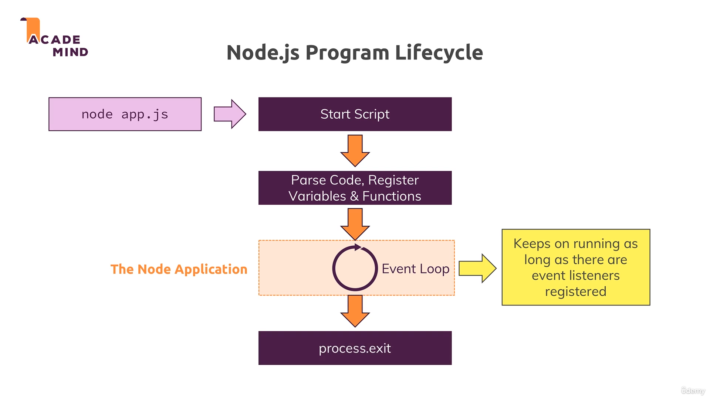

# 🚀 Node.js Module Summary - Complete Guide

## 📝 Module Ka Summary

Chaliye is module ko summarize karte hain ab!

---

## 🌐 Web Kaise Kaam Karta Hai? 


Sabse pehle humne web working ka brief refresher dekha. General mein ye aise kaam karta hai:

**Client (Browser)** → **Request** → **Server** → **Response** → **Client**

- 🖥️ Browser server ko request bhejta hai
- ⚡ Server kuch magic karta hai - database se connect karta hai, files ke saath work karta hai  
- 📤 Phir response wapas bhejta hai (HTML ya kuch aur format mein)
- 🎯 Browser use display kar deta hai

Ye hai complete flow jo humne is module mein dekha!

---

## 🔄 Node.js Lifecycle & Event Loop



### 🎯 Key Concept: Event Loop

Node.js server pe run hota hai aur iske lifecycle mein ek **important concept** hai - **Event Loop**!

#### ⚡ Non-blocking Nature:
- Node.js code **non-blocking** way mein run karta hai
- Hum sirf callbacks aur events register karte hain
- Node.js eventually us code ko trigger karta hai jab task complete ho jata hai
- JavaScript thread hamesha free rehti hai new events handle karne ke liye

#### 🔁 Server Behavior:
- Node program exit ho sakta hai agar koi kaam nahi hai
- Lekin server pe ye kabhi nahi hona chahiye!
- `createServer()` ek event listener register karta hai jo kabhi end nahi hota
- Jab new request aati hai, node event listener ko unregister nahi karta
- Hum continuously more requests ke liye listen karte rehte hain

#### 🎪 Event Loop Ka Cycle:
1. ♻️ Loop continuously chalti rehti hai
2. 👂 New events ka wait karta hai  
3. 💥 Jab koi event hoti hai, kuch action karta hai
4. 🚀 Actions ko operating system mein dispatch karta hai
5. 🆓 Thread ko free kar deta hai

---

## 🔄 Asynchronous Code Ki Power

### 📚 Callback & Event-Driven Approach:
- JavaScript code **non-blocking** hona chahiye
- Hum code register karte hain jo **future mein execute** hoga
- Right away run nahi hota - main thread ko block nahi karta
- **Ye concept bilkul avoid karna hai** - Node.js isi concept ke around built hai!


---

## 📡 Requests & Responses - Node.js Way

### 🧩 Request Data Parsing:
- Request data **chunks mein** aata hai
- **Streams aur Buffers** ka concept use karte hain
- Data ko properly parse karna padta hai

### 🚫 Double Response Se Bachna:
- `res.end()` ke baad **dusra response nahi bhejana**
- Ye easily ho sakta hai agar asynchronous nature bhool jaen
- Event listener mein likha code immediately execute nahi hota!

---

## 🛠️ Node.js Built-in Functionalities

### 🌟 Core Modules Ka Power:
Node.js apni built-in functionalities use karne ke bare mein hai!

#### 📦 Popular Core Modules:
- **HTTP Module** - Server create karne ke liye
- **FS Module** - File system operations
- **Path Module** - File paths handle karne ke liye
- Aur bhi bahut saare! Official Node.js docs mein dekh sakte hain

#### 📥 Import Kaise Kare:
```javascript
const http = require('http');
const fs = require('fs');  
const path = require('path');
```
