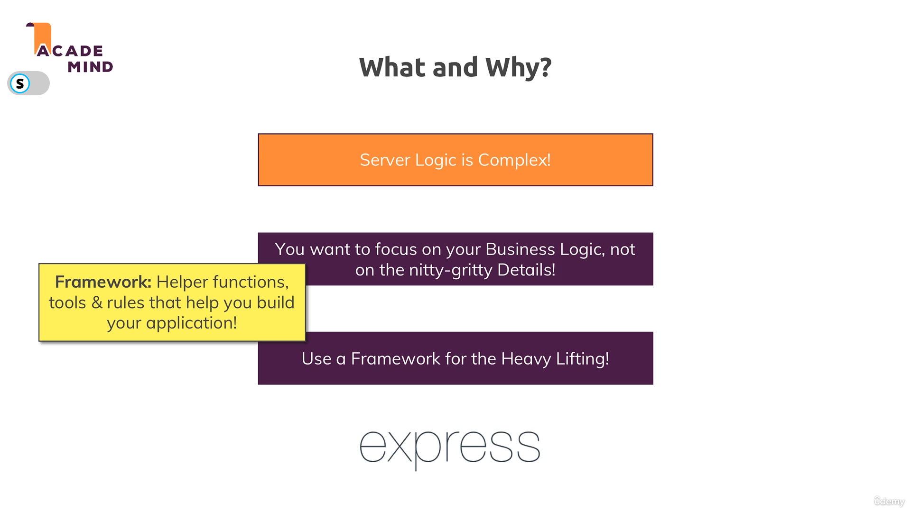

# 🚀 Express.js Kya Hai Aur Kyun Use Karte Hain?

## 🤔 Problem: Manual Server Logic

Server side logic likhna **complex** hai! Incoming request parse karne ke liye:

- Data event listen karna pada
- End event listen karna pada  
- Buffer create karna pada
- String mein convert karna pada

*Aur yeh sirf ek type ka data tha!* 😫

## 💡 Express.js Ka Solution

**Express.js** yeh problems solve karta hai:

- Easy package installation
- Simple project integration  
- Automatic data parsing

## 🎯 Framework Ka Fayda

**Framework** deta hai:

- Helper functions
- Clear structure rules
- Clean code guidelines

*Heavy lifting framework karta hai, hum business logic par focus karte hain!* 🏗️

📸 **Refer image:**  

## 🌟 Express.js Kyun Choose Kare?

### 🆚 Alternatives Hain:

- **Vanilla Node.js** - Manual work, full control
- **Adonis.js** - Laravel-inspired  
- **Koa.js, Sails.js** - Other options

### 👑 Express.js Benefits:

- **Most popular** framework
- **Highly flexible** 
- **Thousands** of third-party packages
- **Easy integration**
- Nice built-in features

## 🏁 Let's Start!

**Chalo install karke explore karte hain!** 🚀💻